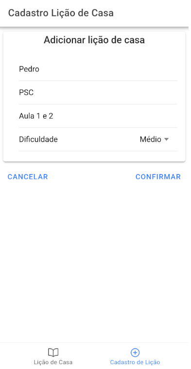

# App_LiçãoDeCasa

📚 Desenvolvi esse aplicativo de lição de casa com o intuito de praticar e melhorar minhas habilidades em desenvolvimento de software e conhecimento de banco de dados. Utilizei TypeScript básico e MySQL para criar uma ferramenta simples que permite aos usuários registrar e visualizar suas tarefas de casa. O aplicativo oferece uma maneira conveniente de acompanhar as lições de casa, ajudando os alunos a se manterem organizados em seus estudos. Essa experiência prática foi fundamental para fortalecer minhas habilidades de desenvolvimento de aplicativos web e integração com banco de dados. Segue imagens do app:

